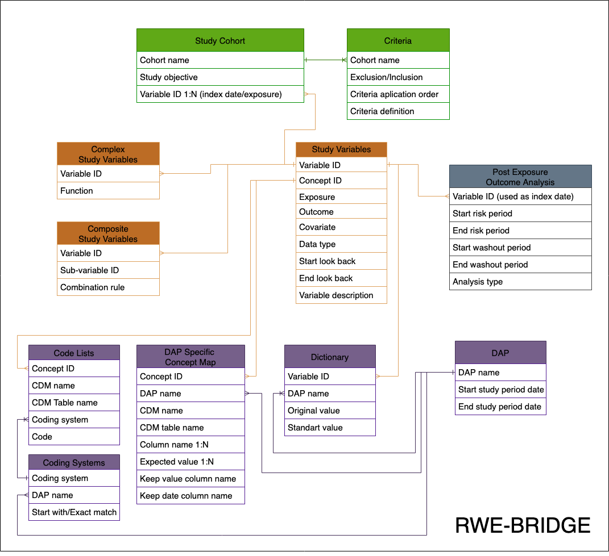

# RWE-BRIDGE

The RWE-BRIDGE is a tool designed to facilitate the translation of study documentation into analytical programming from a programmer's perspective. It proposes a flexible and adaptable metadata model that adheres to previously defined programming complexity metrics of study variables. This metadata model is compatible with any programming language and data model. 

The - provides a clear and systematic approach to analytical programming in RWE studies. Our solution maintains compatibility with multiple databases, standardizes analytical program development, reduces hard coding, and prevents information duplication.

We have also developed a metadata checker that supports our complex metadata population strategy - https://github.com/UMC-Utrecht-RWE/RWEBRIDGE-CHECKER .

Find below the RWE-BRIDGE metadata model diagram.

