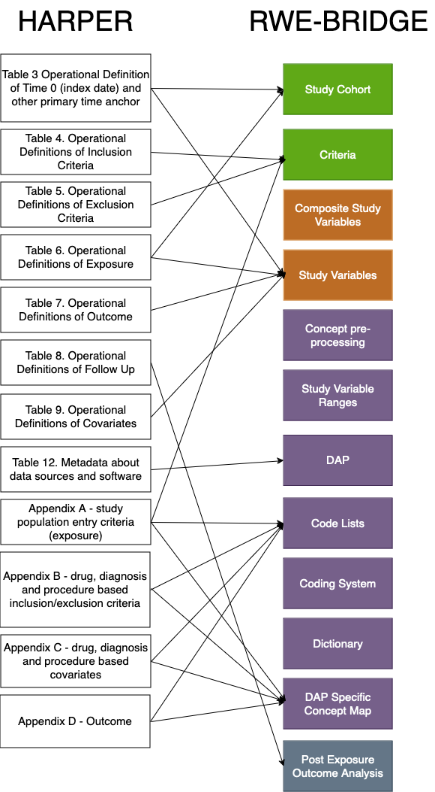

# RWE-BRIDGE

The RWE-BRIDGE is a tool designed to facilitate the translation of study documentation into analytical programming from a programmer's perspective. It proposes a flexible and adaptable metadata model that adheres to previously defined programming complexity metrics of study variables. This metadata model is compatible with any programming language and data model. 

The - provides a clear and systematic approach to analytical programming in RWE studies. Our solution maintains compatibility with multiple databases, standardizes analytical program development, reduces hard coding, and prevents information duplication.

We have also developed a metadata checker that supports our complex metadata population strategy - https://github.com/UMC-Utrecht-RWE/RWEBRIDGE-CHECKER .

Find below the RWE-BRIDGE metadata model diagram.

## Connecting RWE-BRIDGE and RWE tools

The figure below provides an overview of different tools available in the literature and how they connect to each other in the RWE generation pipeline

## Connecting RWE-BRIDGE and HARPER protocol

Below is the information transfer flow from the HARPER protocol to the RWE-BRIDGE. Once you have reviewed and validated the information in the HARPER protocol, you can transfer it to the RWE-BRIDGE metadata scheme following the diagram below.

## Repository Citation 

## Publication 
[Royo AC, Elbers Jhj R, Weibel D, Hoxhaj V, Kurkcuoglu Z, Sturkenboom MCJ, Vaz TA, Andaur Navarro CL. Real-World Evidence BRIDGE: A Tool to Connect Protocol With Code Programming. Pharmacoepidemiol Drug Saf. 2024 Dec;33(12):e70062. doi: 10.1002/pds.70062. PMID: 39603653; PMCID: PMC11602246](https://pubmed.ncbi.nlm.nih.gov/39603653/) 
